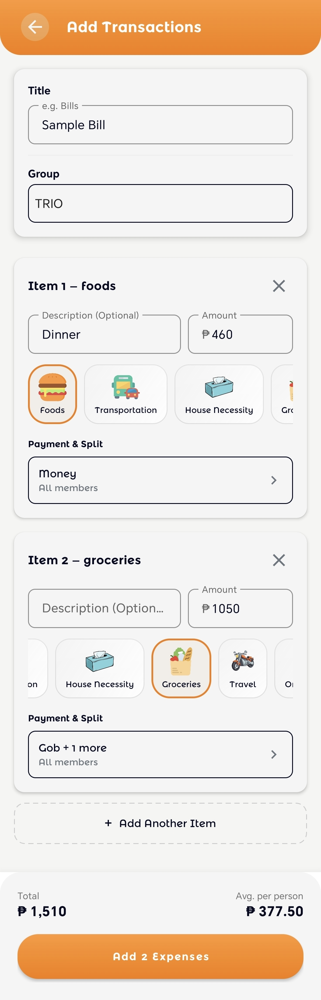

# Test Cases: Add Expense Feature

## 1. Initial State & Group Selection
| Test Case ID | Description | Steps | Expected Result |
| :--- | :--- | :--- | :--- |
| **TC_01** | Initial UI State | Open the Add Multi-Transaction screen. | Title is "Add Expenses". Only Group Spinner is visible. Transaction list, "Add Another Item" button, and Summary Card are hidden. |
| **TC_02** | Group Selection | Select a valid group from the dropdown. | Transaction list appears with one default item. "Add Another Item" button and Summary Card become visible. |
| **TC_03** | No Group Selected | Keep the spinner on the placeholder. | Transaction list remains hidden. Submit button is disabled. |

## 2. Item Management
| Test Case ID | Description | Steps | Expected Result |
| :--- | :--- | :--- | :--- |
| **TC_04** | Add Multiple Items | Click "Add Another Item" button. | A new item card is added to the RecyclerView. If > 1 item, the global "Title" input field becomes visible and required. |
| **TC_05** | Remove Item | Click the "X" button on a specific item card. | The item is removed from the list. Total amount and "Avg. per person" update accordingly. |
| **TC_06** | Category Selection| Tap various category chips (Food, Transport, etc.). | The selected category is highlighted. Validation check passes for the category field. |

## 3. Validation & Calculations
| Test Case ID | Description | Steps | Expected Result |
| :--- | :--- | :--- | :--- |
| **TC_07** | Real-time Total Calculation | Enter ₱100 for Item 1 and ₱250 for Item 2. | Summary Card "Total" displays ₱350.00. |
| **TC_08** | Global Title Validation | Add 2 items. Fill everything but leave the top "Title" field empty. | Submit button remains disabled. |
| **TC_09** | Payment Matching Validation | Set item amount to ₱100 but set Payer amount to ₱50 in the bottom sheet. | Validation error icon appears on the item. Submit button is disabled. |
| **TC_10** | Zero/Negative Amount | Enter "0" or leave amount empty. | Submit button is disabled. Item shows "Please input amount" validation message. |

## 4. Submission & Integration
| Test Case ID | Description | Steps | Expected Result |
| :--- | :--- | :--- | :--- |
| **TC_11** | Successful Submission | Fill all required fields (Group, Title, Amounts, Categories) and click Submit. | Loading overlay appears. Success toast is shown. Activity closes and returns to the previous screen. |
| **TC_12** | Edit Mode Loading | Open activity with an existing `TRANSACTION_ID`. | Screen title is "Edit Transaction". All fields are pre-filled with the existing transaction data. |

## 5. Edge Cases
*   **TC_13: Rapid Adding:** Clicking "Add Another Item" rapidly multiple times should not cause UI lag or crashes.
*   **TC_14: Long Title:** Enter an extremely long title for an item to ensure the layout handles text wrapping or truncation gracefully.
*   **TC_15: Keyboard Persistence:** Tapping outside an EditText or on the Summary Card should hide the software keyboard (verified by `dispatchTouchEvent` logic in the code).
