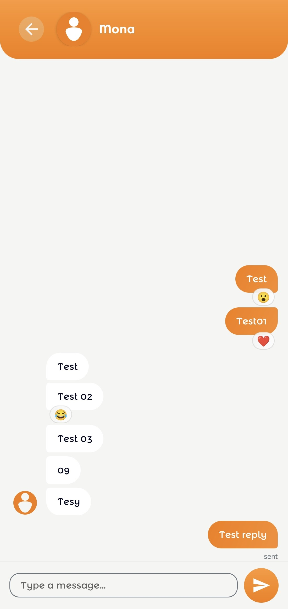

# Test Cases: Direct Message Screen

## 1. Interaction & Identity
| Test Case ID | Description | Steps | Expected Result |
| :--- | :--- | :--- | :--- |
| **TC_DM_01** | Recipient Info | Open a DM from the Crew list. | Recipient's name and avatar are correctly displayed in the header. |
| **TC_DM_02** | Back Navigation | Tap the back arrow in the DM header. | The activity closes and returns the user to the previous screen (e.g., Crew list). |
| **TC_DM_03** | Guest/Blocked State | Open a DM with a "Guest" user (non-registered). | Input field is hidden or replaced by a "Messages unavailable for guests" notice. |

## 2. Messaging Functionality
| Test Case ID | Description | Steps | Expected Result |
| :--- | :--- | :--- | :--- |
| **TC_DM_04** | Private Messaging | Send a message to User B. | Message is only visible in the DM thread between the current user and User B. |
| **TC_DM_05** | Real-time Sync | Send a message from Device 1 and observe Device 2. | Device 2 receives the message instantly via real-time channel. |
| **TC_DM_06** | Message Formatting | Send a message with line breaks. | The bubble preserves the formatting and line breaks correctly. |

## 3. Media & Reactions
| Test Case ID | Description | Steps | Expected Result |
| :--- | :--- | :--- | :--- |
| **TC_DM_07** | Emoji Popup | Tap the emoji icon or long press a message. | The emoji selection popup appears over an overlay. |
| **TC_DM_08** | Outside Tap Dismiss | Open the emoji popup and tap the background overlay. | The popup is dismissed without making a selection. |

## 4. Performance & Reliability
| Test Case ID | Description | Steps | Expected Result |
| :--- | :--- | :--- | :--- |
| **TC_DM_09** | History Loading | Scroll up in a long conversation. | (If pagination implemented) Older messages are loaded and prepended to the list. |
| **TC_DM_10** | Image Loading | View a recipient with a custom avatar. | Avatar loads smoothly from the URL (Coil/Glide) with a crossfade effect. |
| **TC_DM_11** | App Backgrounding | Send a message, move app to background, then return. | The message status should be updated, and the socket/channel should reconnect if dropped. |
