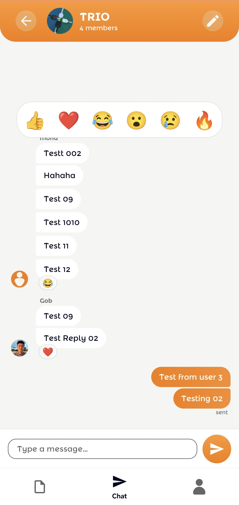

# Test Cases: Group Chat Screen

## 1. Message Sending & Receiving
| Test Case ID | Description | Steps | Expected Result |
| :--- | :--- | :--- | :--- |
| **TC_CHAT_01** | Send Text Message | Type a message and tap the send icon. | Message appears in the list instantly (optimistic UI) and persists after sync. |
| **TC_CHAT_02** | Receive Message | Keep the chat open while another user sends a message. | The message appears in real-time without refreshing the screen. |
| **TC_CHAT_03** | Empty Message | Try to tap send with an empty text field. | Send button is disabled or no action is taken. |
| **TC_CHAT_04** | Long Message | Send a very long text message. | The message bubble expands correctly and wraps text without breaking the UI. |

## 2. Reactions & Interactivity
| Test Case ID | Description | Steps | Expected Result |
| :--- | :--- | :--- | :--- |
| **TC_CHAT_05** | Add Reaction | Long press a message and select an emoji from the popup. | The emoji reaction appears below the message bubble. |
| **TC_CHAT_06** | Remove Reaction | Tap on an existing reaction you previously added. | The reaction is removed from the message. |
| **TC_CHAT_07** | Multiple Reactions | Multiple users react to the same message with different emojis. | All unique emojis are displayed with their respective counts. |
| **TC_CHAT_08** | Read Receipts | Send a message and wait for others to view it. | (If supported) "Read" status or user avatars appear next to the message. |

## 3. UI & Experience
| Test Case ID | Description | Steps | Expected Result |
| :--- | :--- | :--- | :--- |
| **TC_CHAT_09** | Skeleton Loading | Open a group chat with many messages. | Skeleton chat bubbles are shown while the message history is being fetched. |
| **TC_CHAT_10** | Scroll to Bottom | Open a chat or send a message. | The RecyclerView automatically scrolls to the most recent message at the bottom. |
| **TC_CHAT_11** | Timestamp Visibility | Tap on a message bubble. | The hidden timestamp (e.g., "10:30 AM") becomes visible or toggles visibility. |
| **TC_CHAT_12** | Keyboard Management| Tap the input field, then tap the message list. | Keyboard appears when typing and dismisses when interacting with the list (if implemented). |

## 4. Edge Cases
*   **TC_CHAT_13: Offline Sending:** Try sending a message while offline. Shows a "failed" icon or retries when back online.
*   **TC_CHAT_14: Rapid Fire:** Sending multiple messages in quick succession should not cause crashes or duplicate entries.
*   **TC_CHAT_15: Special Characters:** Send messages containing emojis, symbols, and non-Latin characters to ensure proper rendering.
