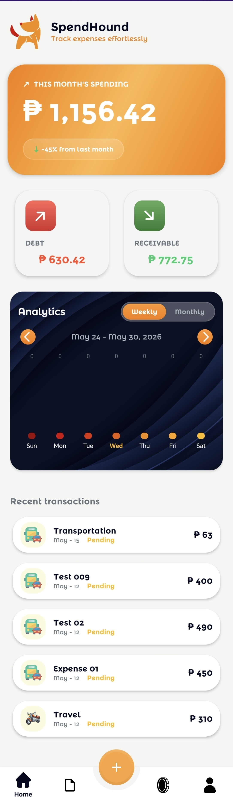

# Test Cases: Home Screen

## 1. Visual Elements & Initialization
| Test Case ID | Description | Steps | Expected Result |
| :--- | :--- | :--- | :--- |
| **TC_HOME_01** | Initial UI State | Launch the app and view the Home screen. | Charts, "You Owe", "You're Owed" cards, and "Recent Transactions" list are visible. |
| **TC_HOME_02** | Data Loading | Open Home screen with an active internet connection. | Skeleton screens appear briefly, then actual data (balances and charts) is populated. |
| **TC_HOME_03** | Pull to Refresh | Swipe down on the Home screen. | Refresh indicator appears, and data is updated from the server. |

## 2. Balance Summary
| Test Case ID | Description | Steps | Expected Result |
| :--- | :--- | :--- | :--- |
| **TC_HOME_04** | You Owe Card | Observe "You Owe" amount. | Displays total amount the user needs to pay back to others. |
| **TC_HOME_05** | You're Owed Card | Observe "You're Owed" amount. | Displays total amount others need to pay the user. |
| **TC_HOME_06** | Navigation from Balance | Tap on "You Owe" or "You're Owed" card. | Navigates to the Borrow/Lend tab to see details. |

## 3. Charts & Time Intervals
| Test Case ID | Description | Steps | Expected Result |
| :--- | :--- | :--- | :--- |
| **TC_HOME_07** | Weekly/Monthly Toggle | Tap on "Weekly" then "Monthly" tabs. | The chart updates to show data grouped by days (Weekly) or weeks/months (Monthly). |
| **TC_HOME_08** | Chart Navigation | Tap "Next" or "Previous" arrows on the date range. | The date range changes (e.g., next week/previous week), and the chart data refreshes for the new period. |
| **TC_HOME_09** | Empty Chart State | Navigate to a period with no transactions. | Chart shows zero values or an empty state indicator. |

## 4. Recent Transactions
| Test Case ID | Description | Steps | Expected Result |
| :--- | :--- | :--- | :--- |
| **TC_HOME_10** | List Content | Observe the "Recent Transactions" section. | Shows the most recent 5-10 transactions across all groups. |
| **TC_HOME_11** | Transaction Item Click | Tap on a transaction in the recent list. | Navigates to the Transaction Details screen for that specific entry. |
| **TC_HOME_12** | Empty List State | Use an account with no transactions. | "No recent transactions" message or illustration is displayed. |
