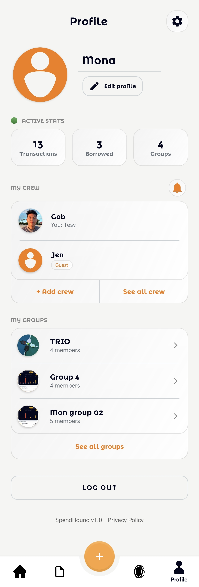

# Test Cases: Profile Screen

## 1. User Information & Stats
| Test Case ID | Description | Steps | Expected Result |
| :--- | :--- | :--- | :--- |
| **TC_PROFILE_01** | Display Profile Info | Open the Profile screen. | Nickname and profile picture are correctly displayed from the database. |
| **TC_PROFILE_02** | Transaction & Group Counts | Observe the stats counts. | Displays the correct number of total transactions and groups the user is part of. |
| **TC_PROFILE_03** | Skeleton Loading | Open profile while data is fetching. | Skeleton placeholders are shown for the nickname, image, and stats. |

## 2. Balance Breakdown
| Test Case ID | Description | Steps | Expected Result |
| :--- | :--- | :--- | :--- |
| **TC_PROFILE_04** | Net Balance Calculation | Observe the "Total Balance" section. | Shows the net result (Owed - Debt). Positive is green, negative is red. |
| **TC_PROFILE_05** | Detailed Breakdown | View Unpaid, You Owe, and You're Owed sections. | The amounts match the sum of transactions in the Borrow/Lend and Transaction tabs. |

## 3. Account Actions
| Test Case ID | Description | Steps | Expected Result |
| :--- | :--- | :--- | :--- |
| **TC_PROFILE_06** | Edit Profile | Tap the "Edit Profile" button/icon. | Navigates to the Edit Profile activity to change nickname or photo. |
| **TC_PROFILE_07** | Change Profile Picture | Tap on the profile image to upload a new one. | Image picker opens. Selecting an image uploads it and updates the UI. |
| **TC_PROFILE_08** | Settings Navigation | Tap the Settings gear icon. | Opens the Settings screen (Currency, Theme, Security, etc.). |
| **TC_PROFILE_09** | Logout | Tap the "Log Out" button. | Confirmation dialog appears. On confirm, the user is signed out and redirected to the Login screen. |

## 4. Crew Management
| Test Case ID | Description | Steps | Expected Result |
| :--- | :--- | :--- | :--- |
| **TC_PROFILE_10** | Manage Crew | Tap on "Manage Crew" or "Add Crew". | Navigates to the Add Crew Activity. |
| **TC_PROFILE_11** | View Crew Members | Tap on the crew members list. | Shows all users added to the user's personal crew list. |
